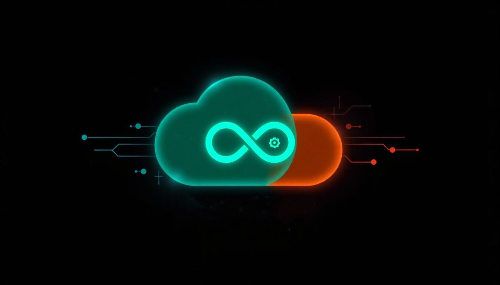

<!-- markdownlint-disable-next-line MD041 -->

<!-- markdownlint-disable-next-line MD033 -->
## 👨‍💻 <ins>About Me</ins>

I’m Mohamed, a passionate **Cloud DevOps Engineer** with a strong focus on building scalable, secure, and automated infrastructure.  
My journey in tech started with a deep curiosity for **Linux and Windows systems** and grew into mastering **cloud platforms, automation tools, and CI/CD pipelines** that power modern businesses.  

i'm based in cairo

💡 I thrive at the intersection of **development and operations** — turning complex requirements into simple, reliable, and reproducible solutions.  

What I do best:

- 🛠️ Deploy **cloud-native architectures** (Azure environments).  
- ⚡ Automate workflows with **Terraform, GitHub Actions, and Bash/Python scripting**.  
- 🐳 Containerize applications with **Docker** and orchestrate at scale with **Kubernetes**.  
- 🔐 Implement **security best practices**, and monitoring.
- 📊 Optimize performance, reliability, and cost efficiency across IT infrastructure.  

🌱 Currently, I’m diving deeper into:

- **Advanced Azure Infrastructure-as-Code (IaC)** strategies with Terraform.  
- **Enterprise-grade CI/CD pipelines** for large-scale systems.  
- **Hybrid cloud identity & access management** with Azure Entra ID.  

Outside of work:

- I enjoy solving **real-world automation challenges**, experimenting with **new open-source tools**, and occasionally breaking (then fixing 😅) my lab environments.  
- I believe in **continuous learning**, knowledge-sharing, and making tech more approachable for newcomers.  

⚡ **Philosophy:**  
_"Don’t just deploy infrastructure — design it to last."_  

---
<!-- markdownlint-disable-next-line MD033 -->
## 📫 <ins>Connect with Me</ins>

 

---
<!-- markdownlint-disable-next-line MD033 -->
## ⚙️ <ins>Tech Stack and Future Roadmap</ins>

| 🏷️ Category | 🚀 Tech Stack | 📖 Current Learning | 🎯 Future Steps |
|-------------|---------------|---------------------|-----------------|
| ☁️ **Cloud Platforms** |  |  |    |
| 📋 **Work Management** |   |  |  |
| 🔀 **Version Control** |   |   | — |
| 🐳 **Containers & Orchestration** |    |   |     |
| ⚙️ **CI/CD** |    |   |  |
| 🏗️ **Infrastructure as Code & Configuration as Code** |     |      |     |
| 🔄 **GitOps** | — |  |  |
| 🕸️ **Service Mesh & APIs** |  |  |  |
| ⚡ **Serverless** | — |   |   |
| 🔐 **Security & Identity Services** |  |      |    |
| 🌐 **Azure Networking Services** |           | — | — |
| 💻 **Azure Compute Services** |    |  |  |
| 💾 **Azure Storage Services** |    |    |    |
| 🗄️ **Databases** |   |   |      |
| 🔗 **Hybrid** | — |  |  |
| 📊 **Monitoring & Log Management** |   |    |       |
| 🔑 **Secrets Mgmt** |  |  | — |
| 📦 **Artifacts** |  |  |  |
| 🌐 **Web Servers** |   |   |  |
| 🧪 **Testing & Quality** | — |  |     |
| 🐧 **OS & Distributions** |    |     |    |
| 📄 **Scripting** |   |   |     |

---

